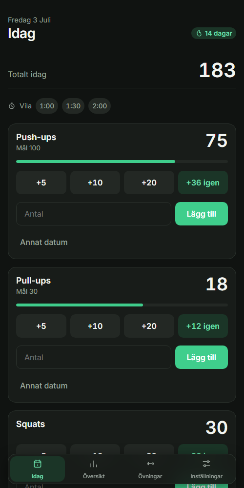
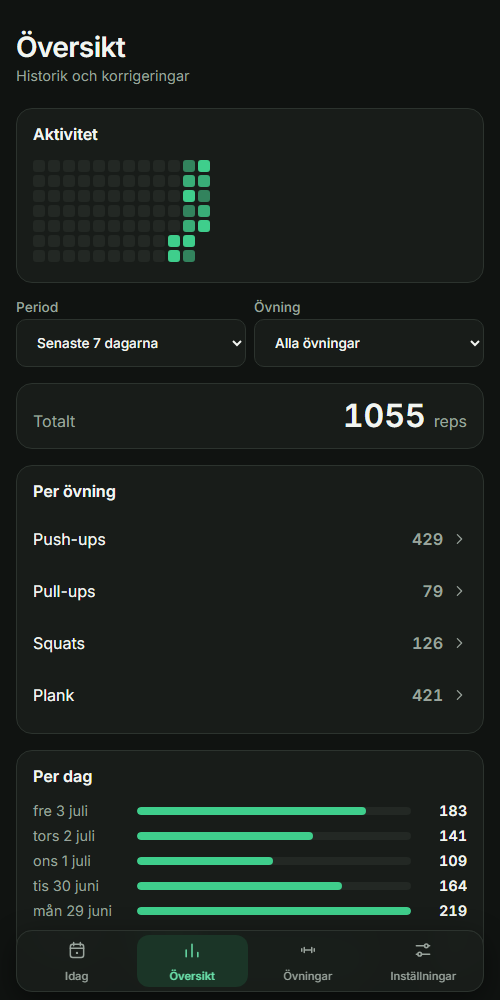
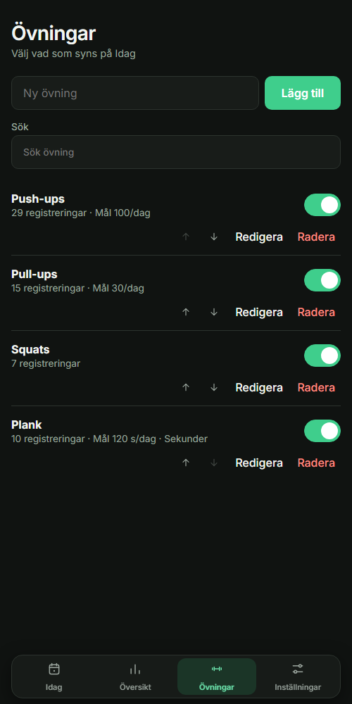

# Rep Counter

[](https://github.com/sockulags/rep-counter/actions/workflows/ci.yml)

Mobile-first PWA for logging daily exercise repetitions with local storage only.

**Live demo:** [sockulags.github.io/rep-counter](https://sockulags.github.io/rep-counter/)

| Today | Overview | Exercises |
| --- | --- | --- |
|  |  |  |

## Features

- Fast daily rep logging with quick buttons and manual input.
- Active exercise carousel for the Today view.
- Overview with period filters, exercise filters, daily totals, and editable entries.
- Exercise management with built-in suggestions and custom exercises.
- Local-only data storage with reset support.
- Installable PWA with basic offline support.

## Development

```bash
npm install
npm run dev
```

## Checks

```bash
npm test
npm run lint
npm run build
```

## Deployment

The site deploys to GitHub Pages through `.github/workflows/pages.yml` on pushes to `main`.

## License

[MIT](LICENSE)
